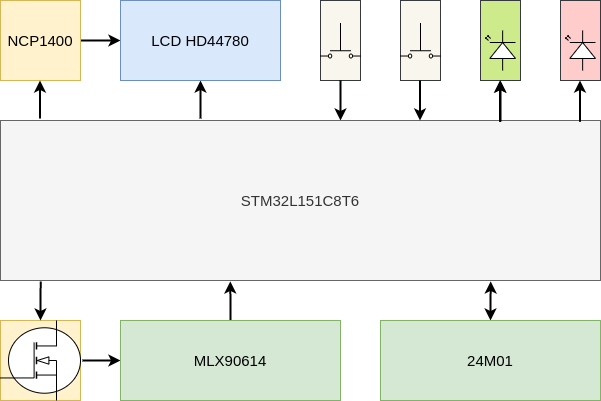
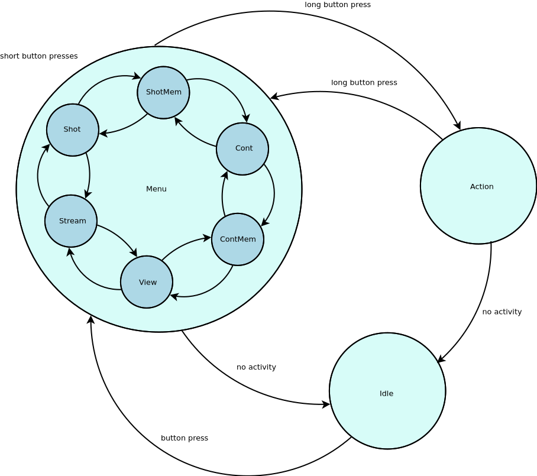

# Overview
Rust firmware for IR thermometer based on STM32L151CBT6 and MLX90614.

## Hardware
Hardware diagram:



Notes
* No JTAG/SWD: firmware loaded using STM32 serial bootloader
* Both EEPROM (AT24) and IR sernsor (MLX90614) are connected to I2C1

## Firmware
Firmware diagram:



### Components
* Firmware is based on [RTIC](https://crates.io/crates/cortex-m-rtic) framework
* LCD driver [hd44780](https://crates.io/crates/hd44780-driver)
* MLX90614 driver [mlx9061x](https://crates.io/crates/mlx9061x) 
* AT24 EEPROM driver [eeprom24x](https://crates.io/crates/eeprom24x)
* Independent watchdog is used to reboot system in the case of any lockup issues
* Red LED is used to indicate when battery voltage drops below 2.5V
* Green LED is used for heartbeats

### Notes
* Currently __Idle__ state has nothing to do with MCU low power modes: LCD and MLX90614 are powered off, but MCU still runs on HSI
* MLX90614 and AT24 drivers share I2C1 bus using [shared-bus-rtic](https://crates.io/crates/shared-bus-rtic) 

### User interface
Navigation through menu is performed using short button presses. Menu item selection is performed by long button presses.
Menu items:
* __Shot__
  * single temperature measurements triggered by short button presses
* __ShortMem__
  * single temperature measurements triggered by short button presses
  * each measurement is stored to EEPROM
  * each new measurement session erases previous EEPROM content
* __Cont__
  * continuous temperature measurements with 1 sec interval
* __ContMem__
  * continuous temperature measurements with 1 sec interval
  * each measurement is stored to EEPROM
  * each new measurement session erases previous EEPROM content
* __View__
  * display measurements stored in EEPROM one-by-one using short button presses
* __Stream__
  * continuously display measurements stored in EEPROM with 1 sec interval
  * stream measurements to UART to enable scripting and processing
* __Battery__
  * single battery voltage measurements triggered by short button presses

# Quick start guide
## Custom runner
The board does not have JTAG or SWD connector. So it has to be programmed through UART using ST bootloader.
To simplify build and flash procedure, custom cargo runner is implemented. This script does
the following two things:
* run ```cargo-binutils``` to generate ```ihex``` binary format
* run ```stm32flash``` to program device through UART

Note that BOOT0 jumper shall be properly connected to switch MCU into UART boot mode.

Custom runner calls stm32flash and llvm-objdump using certain default parameters,
including baudrate, serial port, and binary format. Those changes can be modified
using custom runner script input parameters:

```
cargo run --release --example test-led -- -h

Examples:
$ cargo run --example test-led
$ cargo run --release --example test-led
$ cargo run --example test-led -- -p /dev/ttyUSB1 -r 9600
$ cargo run --example test-led -- -t bin

Supported additional options:
Options:
  -t, --type          bin or ihex, default is ihex
  -p, --port          serial port, default is /dev/ttyUSB0
  -r, --rate          serial port baud rate, default is 115200
```

## I2C selection using cargo features
Tests and binaries support two different i2c implementations:
* i2c hardware block on stm32l1x microcontroller
* i2c software bitbang implementation

Any of the options can be selected using ```cargo``` features: ```i2c_hw``` or ```i2c_bb```.
By default ```i2c_hw``` option is selected:

```
$ cargo run --release --example test-i2c-at24
$ cargo run --release --example test-i2c-mlx90614
$ cargo run --release --no-default-features --features i2c_bb --example test-i2c-at24
$ cargo run --release --no-default-features --features i2c_bb --example test-i2c-mlx90614
```

## Firmware size checks
Use ```cargo-binutils``` to check firmware size summary:
```
$ $ cargo size --release --bin rust-ir-thermo 
   text	   data	    bss	    dec	    hex	filename
  48476	      0	    240	  48716	   be4c	rust-ir-thermo

$ cargo size --release --example test-i2c-at24
   text	   data	    bss	    dec	    hex	filename
  15220	      0	     12	  15232	   3b80	test-i2c-at24
```

Use additional option to get all sections sizes:
```
$ cargo size --release --bin rust-ir-thermo -- -A
rust-ir-thermo  :
section              size        addr
.vector_table         292   0x8000000
.text               40428   0x8000124
.rodata              7756   0x8009f10
.data                   0  0x20000000
.bss                  124  0x20000000
.uninit               116  0x2000007c
.debug_str          48797         0x0
.debug_abbrev        3022         0x0
.debug_info         34958         0x0
.debug_aranges       1448         0x0
.debug_ranges       25584         0x0
.debug_pubnames     12771         0x0
.debug_pubtypes       342         0x0
.ARM.attributes        48         0x0
.debug_frame         4956         0x0
.debug_line         39301         0x0
.comment              147         0x0
Total              220090
```

Use ```cargo-bloat``` to find out what takes most of the space in firmware binary:
```
$ cargo bloat --release --bin rust-ir-thermo 
 File  .text    Size          Crate Name
 3.0%  18.8%  7.4KiB            std core::fmt::float::float_to_decimal_common_shortest
 2.7%  16.7%  6.6KiB            std core::fmt::float::float_to_decimal_common_exact
 1.7%  10.5%  4.1KiB      [Unknown] EXTI2
 1.2%   7.3%  2.9KiB rust_ir_thermo rust_ir_thermo::init
 0.5%   3.2%  1.3KiB            std <char as core::fmt::Debug>::fmt
 0.4%   2.6%  1.0KiB            std compiler_builtins::int::udiv::__udivmoddi4
 0.3%   1.9%    782B            std core::num::bignum::Big32x40::mul_digits
 0.3%   1.9%    768B            std core::str::slice_error_fail
 0.3%   1.9%    766B            std core::fmt::Formatter::pad
 0.3%   1.7%    696B            std core::fmt::Formatter::write_formatted_parts
 0.2%   1.5%    626B            std core::num::flt2dec::strategy::dragon::mul_pow10
 0.2%   1.5%    610B            std core::fmt::Formatter::pad_integral
 0.2%   1.5%    604B            std core::fmt::num::<impl core::fmt::Debug for usize>::fmt
 0.2%   1.2%    466B            std core::fmt::write
 0.2%   1.1%    434B            std core::num::flt2dec::round_up
 0.2%   1.0%    414B            std <&T as core::fmt::Debug>::fmt
 0.2%   1.0%    404B            std compiler_builtins::float::add::__addsf3
 0.2%   0.9%    384B            std compiler_builtins::float::div::__divsf3
 0.2%   0.9%    382B            std <core::fmt::builders::PadAdapter as core::fmt::Write>::write_str
 0.1%   0.9%    358B            std compiler_builtins::float::mul::__mulsf3
 3.5%  21.7%  8.6KiB                And 101 smaller methods. Use -n N to show more.
16.0% 100.0% 39.5KiB                .text section size, the file size is 247.3KiB
```
